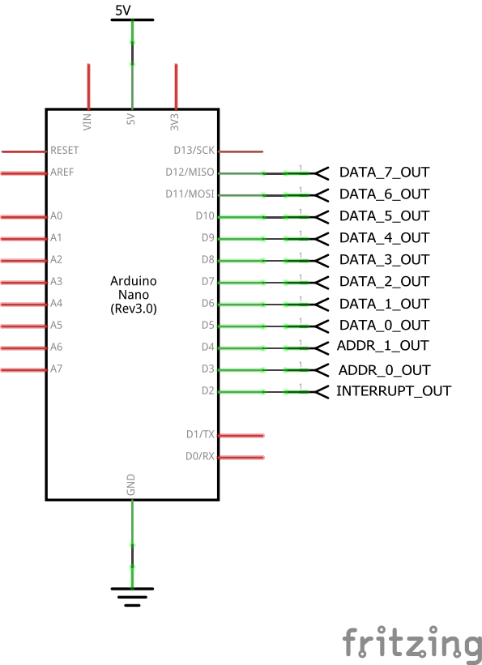

#  DIY DISPLAY TESTER

This is a simple test harness for memory mapped [display](https://github.com/skagra/diy-display) for the [diy-cpu](https://github.com/skagra/diy-cpu) project.

# Circuit

The project uses an Arduino with connections defined in [Pins.h](Pins.h).

In addition to these connections, the `ENABLE` line of the display circuit must be tied high.

# Board

The following shows the display board together with the test rig.

